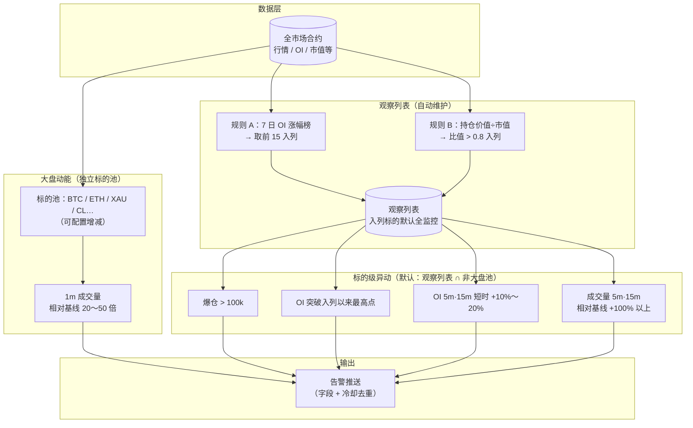
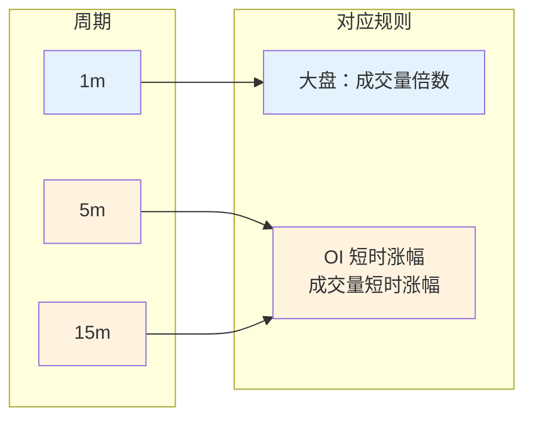
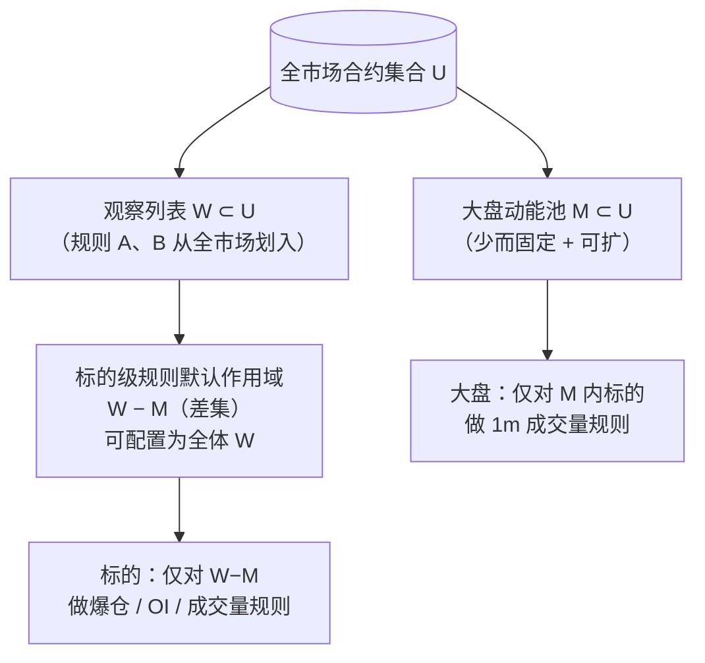
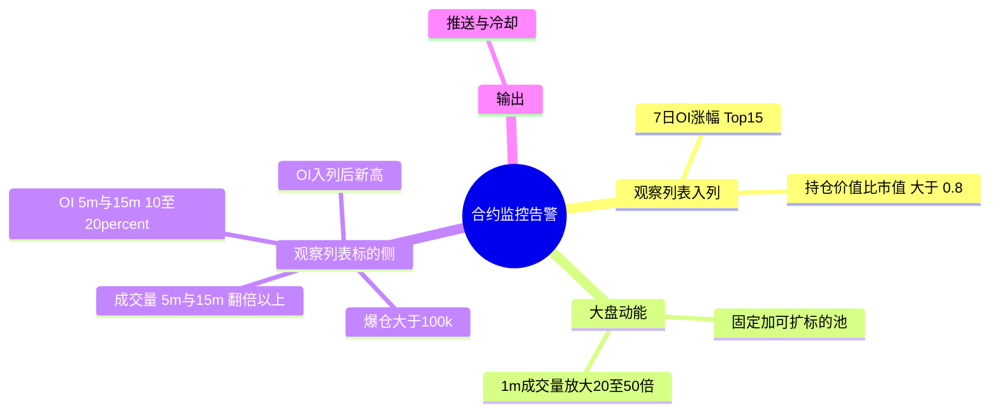

# 监控工具覆盖面示意图

## 怎么才能真正看到图？

Cursor / VS Code **自带的 Markdown 预览默认不会渲染 Mermaid**，所以你会只看到灰色代码块。可以任选一种方式：

1. **最省事（推荐）**：用 Chrome / Safari 等浏览器**直接打开**同目录下的静态页  
   **`coverage-preview.html`**（双击文件或在浏览器里「文件 → 打开文件」）。需要能访问外网（会从 jsDelivr 加载 Mermaid 脚本）。
2. **留在编辑器里预览**：在扩展市场安装 **Markdown Preview Mermaid Support**（发布者 *Matt Bierner*，扩展 ID：`bierner.markdown-mermaid`），安装后重新打开 `.md` 的预览窗口。
3. **在线**：把下面某个 \`\`\`mermaid 代码块复制到 [mermaid.live](https://mermaid.live) 左侧即可出图。
4. **GitHub**：把仓库推到 GitHub，在网页里打开本 `.md`，一般会直接渲染 Mermaid。

思维导图（图 4）对 Mermaid 版本较挑剔；若打不开，以图 1～3 为准即可。

---

## 图 1：三层覆盖——数据从哪来、规则落在哪

下图从上到下表示：**全市场**如何「喂」观察列表；**大盘动能**与**观察列表标的**两条线各自产生哪些告警（最后在推送层汇合）。



**读图要点**

- **竖向两条主线**：左下经「观察列表」的是长尾异动；中间「大盘动能」不依赖是否入列，代表**板块级**异常放量。  
- **标的级四条**默认不盯 BTC/ETH 等大盘池内合约（由配置 `alt.scope` 决定），避免与大盘规则重复刷屏。

---

## 图 2：时间周期覆盖（哪些规则看哪根 K 线）



入列扫描、7 日 OI、爆仓等多为**事件或滚动窗口**，不绑定单一 K 线周期，故未画在上表中。

---

## 图 3：集合关系（谁在被「盯」）



**说明**：`W` 与 `M` 可相交（例如某大盘币因 OI 榜同时出现在 `W` 与 `M`）；默认标的侧规则只在 **`W` 去掉 `M`** 上触发，避免与大盘线重复。

---

## 图 4：思维导图（一屏总览）

若你的预览器支持 `mindmap`：



---

## 图 5：ASCII 备用（任意文本环境可复制）

```
+------------------- 全市场 U -------------------+
|  +-----------+    +-------------------------+  |
|  | 大盘池 M  |    | 其余合约（可进观察列表）   |  |
|  | BTC,ETH… |    | 规则A Top15  规则B 比值>0.8 |
|  +-----------+    +-----------W-------------+  |
+-------------------|--------------------------+
                    |
         +----------+----------+
         v                     v
   [1m 量 20~50x]        [W \ M 上四规则]
   -> 大盘告警            -> 标的告警
         \                   /
          v                 v
            [ 告警推送 + 冷却 ]
```

---

*与《需求说明》同步：首期范围以需求文档为准；图示仅帮助建立直觉。*
